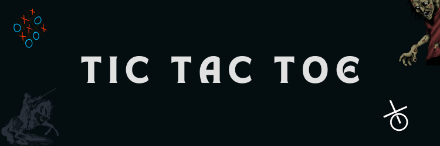
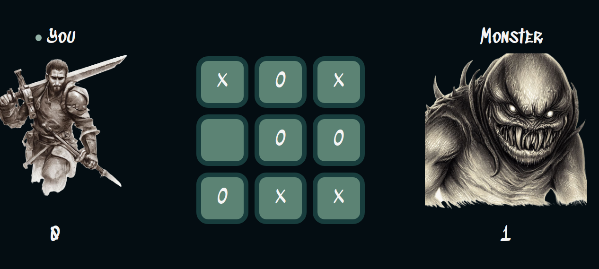

Tic tac toe game using the minimax algorithm.

## Overview



For a live preview click [here](https://lindelwa122.github.io/odin-tic-tac-toe).

## What I Learned?

* Learned how to use **factory functions** and **module patterns** to organize **JavaScript**.
* I now understand how the **minimax algorithm** works and how to implement it.

## How it works

### [The Minimax Algorithm](https://en.wikipedia.org/wiki/Minimax)

Recursively, the algorithm simulates all possible games that can take place beginning at the current state and until a terminal state is reached. Each terminal state is valued as either (-1), 0, or (+1).

#### currentPlayer

Takes the *board* and tells us whose turn is it.

```javascript
const _currentPlayer = (state) => {
    const xCount = state.filter((cell) => cell === "X").length;
    const oCount = state.filter((cell) => cell === "O").length;

    if (xCount < oCount || xCount === oCount) return "X";
    else if (xCount > oCount) return "O";
};
```

The first player to play a round is always player "X", so if the board has an equal amount of Xs and Os the function returns "X".

#### actions

Takes a *state* and gives us all the possible actions a player can take.

```javascript
const _actions = (state) => {
    return state.filter((cell) => cell !== "O" && cell !== "X");
};
```

#### result

Takes a *state*, performs an *action* and then returns a new state.

```javascript
const _result = (state, action) => {
    const copy = state.map((item) => item);
    copy[action.index] = action.marker;
    return copy;
};
```

#### terminal

Takes a *state* and returns `true` if the game is over otherwise false.

```javascript
const _terminal = (state) => {
    if (
      _actions(state).length === 0 ||
      _winning(state, "X") ||
      _winning(state, "O")
    )
      return true;
    else return false;
};
```

#### utility 

Takes a state returns some value of that state. Returns `1`
if "X" won, `-1` if "O" won, otherwise it returns `0`.

```javascript
const _utility = (state) => {
    if (_winning(state, "X")) return -1;
    else if (_winning(state, "O")) return 1;
    else return 0;
};
```

#### minimise

Picks *action a* in *actions(state)* with the lowest value of *maximise(results(state, a))*.

```javascript
const _minimise = (state) => {
    if (_terminal(state)) {
      return { value: _utility(state) };
    }

    const record = {
      value: 1000000,
      index: -1,
    };

    for (const action of _actions(state)) {
      const a = { index: action, marker: _currentPlayer(state) };
      const newState = _result(state, a);
      const value = Math.min(record.value, _maximise(newState).value);
      if (value !== record.value) {
        record.value = value;
        record.index = action;
      }
    }

    return record;
  };
```

#### maximise

*miximise* does the opposite of *minimise*. It picks *action a* in *actions(state)* with the highest value of *minimise(results(state, a))*.

#### minimax

Using all the above functions, creating the minimax function then becomes very easy.

```javascript
const _minimax = (state) => {
    const record = _maximise(state);
    return record.index;
};
```

### Controllers

I have 3 factory functions that I use to control different functionalities of the game.

1. **gameboard**: is responsible for creating the board, updating it, retrieving it, and finding winning combinations.

2. **gameController**: is responsible for deciding whose turn is it to play, keeping track of scores and win status, reseting the game, and communication with **gameboard** and **displayController** to keep the game running.

3. **displayController**: responsible for everything you see on the screen including updating the visual board, score, indicators, and displaying the winner. One of the functionalities that I am most proud of is **getPlayerPosition**. This is an an asynchronous function that is invoked in the **player** constructor and works almost like `prompt`, it waits for the player to make their choice before proceeding.

    ```javascript
    // getPlayerPosition is invoked here...
    const play = async () => {
        ...
        // wait for the player to make their choice
        const cell = await displayController.getPlayerPosition();

        const { row, column } = grid[cell];
        const updated = gameboard.updateBoard(row, column, marker);
        ...
    };
    ```

    ```javascript
    const getPlayerPosition = () => {
        const items = document.querySelectorAll(".cell");

        return new Promise((resolve) => {
        const handleClick = (e) => {
            items.forEach((item) => {
            item.removeEventListener("click", handleClick);
            });
            resolve(e.target.dataset.cell);
        };

        items.forEach((item) => {
            item.addEventListener("click", handleClick);
        });
        });
    };
    ```

### Constructors

I have 2 constructors, one creates `player`, and the other inherits from `player` to create `computer`.

## Credits

* This [project](https://www.theodinproject.com/lessons/node-path-javascript-tic-tac-toe) is part of the Odin Project's [curriculum](https://www.theodinproject.com).
* Images were created using Bing Image Creator.

## Conclusion

Feel free to give this repository a star and use the code as you please.

Happy Coding :)